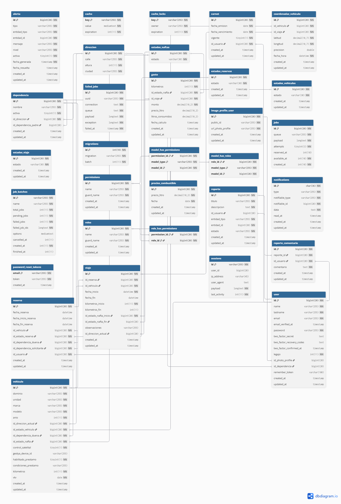
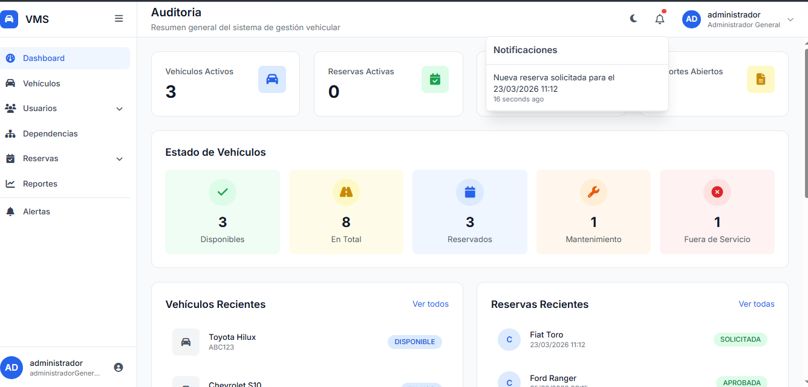
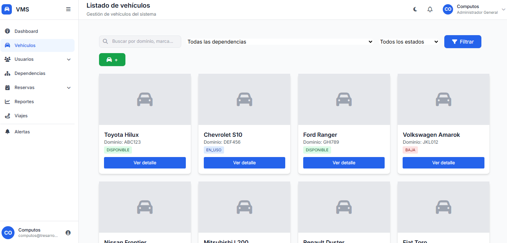
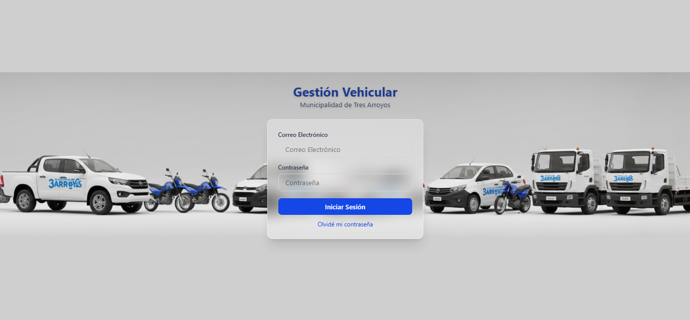
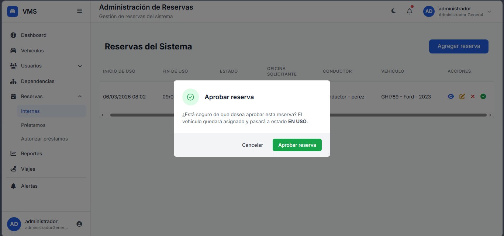
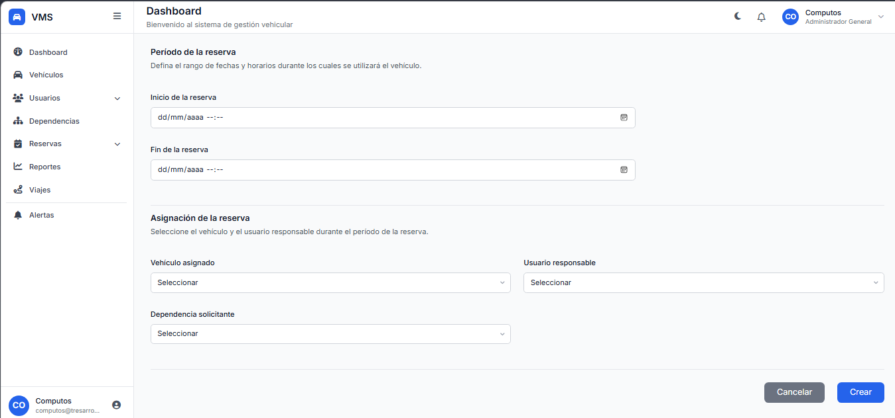

# GestionVehicular


## 📌 Objetivo
La municipalidad de Tres Arroyos cuenta con una flota de vehiculos limitada que debe ser compartida entre distintas areas y entes municipales. El presente proyecto propone el desarrollo de un sistema informatico web para organizar,controlar y optimizar el uso de dichos vehiculos.

## 🧰 Tecnologías utilizadas

-   **Backend:** Laravel 12
-   **Frontend:** Blade, Bootstrap, HTML/CSS, JavaScript , TailwindCSS , Vite 
-   **Base de datos:** MySQL 
-   **Control de versiones:** Git y GitHub
-   **Servidor local:** Laragon 

## Instalación y ejecución 🚀

### Requisitos previos
-   Laravel": "^12.0
-   PHP <= 8.2.28
-   Composer
-   Node.js + npm": "^10.9.0
-   MySQL o MariaDB": "^5.7.33
-   Laragon": "^5.0.0 / XAMPP / WAMP
-   Vite": "^7.0.7
-   TailwindCSS": "^3.4.19 
-   Fontawesome": "^7.0
-   AlpineJS": "^3.13.3
-   ChartJS": "^4.5.1
-   Maatwebsite/excel": "^3.1"

### Pasos

1. Clonar el repositorio:

    ```bash
    git clone https://github.com/ingridl23/GestionVehicular.git
    cd GestionVehicular
    ```

2. Instalar dependencias de laravel y Frontend

    ```bash
    composer install
    npm install && npm run dev
    ```

3. Configurar el entorno

```bash
 cp .env.example .env
```

4.Generar la clave de aplicacion y generar la base de datos

```bash
php artisan key:generate
php artisan migrate --seed
```

5.Levantar el Servidor

```bash
php artisan serve
```

## 📂 Estructura general

Este proyecto sigue la estructura estándar de Laravel, organizada para mantener una separación clara entre la lógica de negocio, la configuración, las vistas y los recursos públicos.

Descripción de carpetas y archivos

-   **`app/`** –
    Contiene el núcleo de la aplicación, incluyendo controladores, modelos, middleware y otros elementos relacionados con la lógica de negocio.
-   **`Http/`**
    Incluye la capa de control y gestión de las peticiones HTTP.

-   `Controllers` – Controladores que procesan solicitudes y devuelven respuestas.

    -   `Middleware` – Filtros que procesan solicitudes antes o después del controlador.

    -   `Requests` – Clases para validar datos de entrada de formularios y peticiones.

-   **`Mail/`** – Clases para la gestión y envío de correos electrónicos.

    -   **`Models/`** – Representación de las entidades y su interacción con la base de datos. Ejemplos: Direccion, Emprendedor, Imagen, Noticia, Red, User.

-   **`Providers/`** – Registro y configuración de servicios del framework.

-   **`View/Components/`** – Componentes reutilizables para las vistas.

-   **`bootstrap/`** –
    Archivos de inicialización del framework y configuración del arranque de la aplicación.

-   **`config/`** –
    Archivos de configuración general del proyecto (base de datos, correo, servicios, etc.).

-   **`database/`** –
    Migraciones, seeders y factories para gestionar la estructura y datos de la base de datos.
-   **`node_modules/`** –
    Dependencias instaladas mediante Node.js, utilizadas para compilación y construcción de recursos frontend.

-   **`public/`** –
    Carpeta accesible públicamente donde se almacenan archivos compilados (CSS, JS, imágenes) y el archivo de entrada index.php.

-   **`resources/`** –
    Contiene los recursos sin procesar utilizados en el frontend.

-   `views/` – Vistas Blade.
-   `css/` – Estilos personalizados.
-   `js/` – Scripts personalizados.
-   `lang/` – Archivos de traducción.
-   `sass/` – Estilos SASS/SCSS.

-   **`routes/`** – Definición de rutas.

    -   `web.php` – Rutas para solicitudes HTTP web.

-   **`.env`** – Variables de entorno y configuración sensible.

-   **`README.md`** – Documentación del proyecto.

### Estructura de archivos

```
├── app/
   |_______http/
     |__ Controllers
     |__ Middleware
     |__ Requests
   |_______Mail/
   |_______Models/
     |__Alerta
     |__Carnet
     |__CooordenadasVehiculo
     |__Dependencia
     |__Direcciones
     |__EstadosNafta
     |__ EstadosReserva
     |__ EstadosVehiculo
     |__ EstadosViaje
     |__ Gasto
     |__PrecioCombustible
     |__ReporteComentarios
     |__Reportes
     |__Reserva
     |__ User
     |__Vehiculo
     |__Viaje
   |______Notifications/
   |______Policies/
   |______Providers/
   |______View/
     |__Components
|__boostrap/
|__config/
├── database/
|__docs/
|__node_modules/
├── public/
├── resources/
│ ├── views/
│ ├── css/
│ └── js/
| |__ lang/
| |__ sass/
├── routes/
│ └── web.php
├── .env
└── README.md
```

### Estructura de la base de datos




## Captura Dashboard Admin General

## Captura Vehiculos listado

## Captura Login

## Captura Reservas Listado


## Captura Form Reservas



## 📍 Rutas

```
## 🚀 Rutas del Sistema

| Método | URI | Nombre | Controlador |
|--------|-----|--------|------------|
| GET | / | home | HomeController@inicio |
| GET | admin/agregar-prestamo | admin.prestamo.form.agregar | PrestamoController@mostrarFormulario |
| POST | admin/agregar-prestamo | admin.reservas.externas.crear | PrestamoController@crearReserva |
| GET | admin/agregar-reserva | admin.reservas.form.agregar | ReservaController@mostrarFormulario |
| POST | admin/agregar-reserva | admin.reservas.internas.crear | ReservaController@crearReserva |
| PATCH | admin/aprobar-reserva/{id} | admin.reservas.aprobar | ReservaController@autorizarReserva |
| GET | admin/auditoria | admin.auditoria.index | HistorialController@index |
| PATCH | admin/autorizar-prestamo/{id} | admin.reservas.autorizar | PrestamoController@autorizarPrestamo |
| GET | admin/autorizar-prestamos | admin.reservas.autorizar-prestamos | PrestamoController@verReservasPendientes |
| PATCH | admin/cancelar-reserva/{id} | admin.reservas.cancelar | ReservaController@cancelarReserva |
| GET | admin/dashboard | admin.admin.dashboard | UserController@adminDashboard |
| PATCH | admin/editar-prestamo/{id} | admin.reservas.externas.editar | PrestamoController@editarReserva |
| GET | admin/editar-prestamo/{id} | admin.prestamo.form.editar | PrestamoController@mostrarFormularioUpdate |
| PATCH | admin/editar-reserva/{id} | admin.reservas.internas.editar | ReservaController@editarReserva |
| GET | admin/editar-reserva/{id} | admin.reservas.form.editar | ReservaController@mostrarFormularioUpdate |
| GET | admin/reportes | admin.reportes.index | ReporteController@index |
| POST | admin/reportes | admin.reportes.store | ReporteController@store |
| GET | admin/reportes/create | admin.reportes.create | ReporteController@create |
| DELETE | admin/reportes/{reporte} | admin.reportes.destroy | ReporteController@destroy |
| GET | admin/usuarios | admin.usuarios.index | UserController@index |
| POST | admin/usuarios | admin.usuarios.store | UserController@store |
| GET | admin/usuarios/{usuario} | admin.usuarios.show | UserController@show |
| PUT/PATCH | admin/usuarios/{usuario} | admin.usuarios.update | UserController@update |
| DELETE | admin/usuarios/{usuario} | admin.usuarios.destroy | UserController@destroy |
| GET | dependencias | dependencias.index | DependenciaController@verDependencias |
| POST | dependencias | dependencias.store | DependenciaController@crearDependencia |
| GET | dependencias/{id} | dependencias.show | DependenciaController@verDependencia |
| PATCH | dependencias/{id} | dependencias.update | DependenciaController@editarDependencia |
| DELETE | dependencias/{id} | dependencias.destroy | DependenciaController@eliminarDependencia |
| GET | operativo/mis-reservas | operativo.mis-reservas | ReservaController@misReservas |
| POST | operativo/reserva/create | operativo.reservar | ReservaController@crearReserva |
| POST | operativo/reserva/update/{id} | operativo.actualizar-reserva | ReservaController@editarReserva |
| GET | operativo/reservas/form | operativo.reservas-form | ReservaController@mostrarFormulario |
| GET | operativo/reservas/filtro | operativo.filtrar-reservas-int | ReservaController@filtrarReservasInternas |
| GET | operativo/viajes | operativo.viajes.index | ViajeController@index |
| POST | operativo/viajes/{reserva}/comenzar | operativo.viajes.comenzar | ViajeController@comenzarViaje |
| POST | operativo/viajes/{viaje}/finalizar | operativo.viajes.finalizar | ViajeController@finalizarViaje |
```


## 👥 Roles y permisos

El sistema cuenta con distintos tipos de usuarios, cada uno con funcionalidades específicas:

### Administrador General

•	Gestión completa de usuarios, dependencias y vehículos.
•	Administración de reservas y préstamos entre dependencias.
•	Acceso a reportes, auditorías y estadísticas globales.
•	Visualización y modificación de toda la información del sistema.
Este rol tiene control total y no presenta restricciones por dependencia


### Administrador De Dependencia

•	Administrar el personal perteneciente a su dependencia.
•	Gestionar vehículos asignados a su dependencia.
•	Aprobar o rechazar reservas.
•	Intervenir en préstamos de vehículos con otras dependencias.
•	Visualizar y operar únicamente sobre información de su dependencia.
Este rol permite descentralizar la gestión y reducir la carga operativa del Administrador General.


### Jefe De Area

•	Visualizar el personal de su dependencia.
•	Consultar dependencias (incluyendo dependencias subordinadas si corresponde jerárquicamente).
•	Solicitar reservas de vehículos.
•	Consultar el estado de reservas y solicitudes.
No posee permisos de administración completa, pero sí de operación y consulta.


### Operativo

•	Solicitar reservas de vehículos.
•	Recibir asignaciones de vehículos por parte de administradores.
•	Consultar el estado de sus reservas.
•	Iniciar y finalizar viajes asociados a una reserva.
•	Registrar datos del viaje (kilometraje, combustible, observaciones).
•	Generar reportes de incidentes o situaciones relacionadas con el uso del vehículo.
Este rol interactúa directamente con el flujo operativo del sistema, especialmente con las entidades Reserva, Viaje y Gasto, según el modelo de datos.


## 📚 Créditos

### Desarrollado por:

Ingrid Ledesma – Desarrollador en  Municipalidad de Tres Arroyos - Oficina Centro De Computos

### Carrera: TUDAI (Desarrollo de Aplicaciones Informáticas) – UNICEN

## ⚖️ Licencia

Proyecto de uso institucional. Su distribución, copia o modificación está sujeta a autorización de la Municipalidad de Tres Arroyos y sus autores._

